# Jungle

A mini e-commerce application built with Rails 6.1 that allows visitors to view and purchase products.

# Technical Specifications

- Ruby
- Rails 6.1 [Rails Guide](http://guides.rubyonrails.org/v6.1/)
- Bootstrap 5
- PostgreSQL 9.x
- Stripe
- CSS
- RSpec
- Cypress

# Screenshots

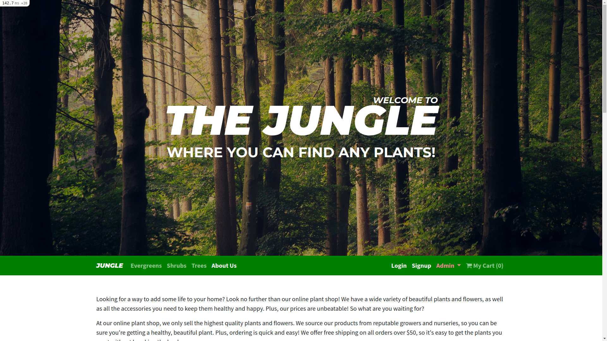
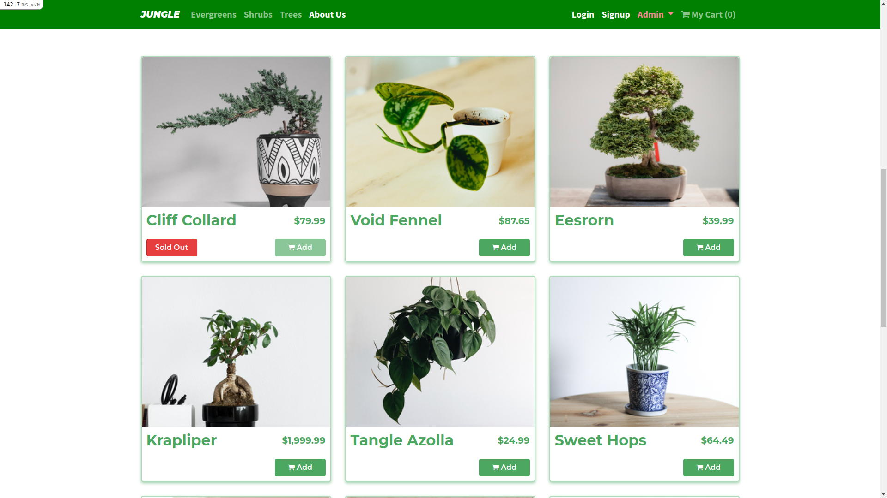
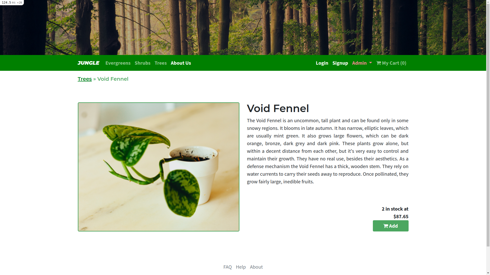
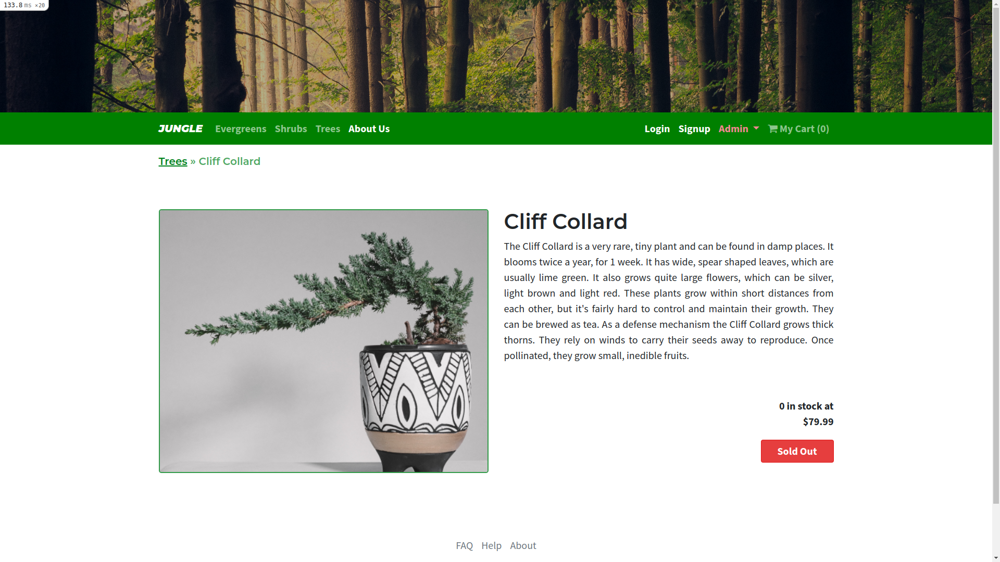
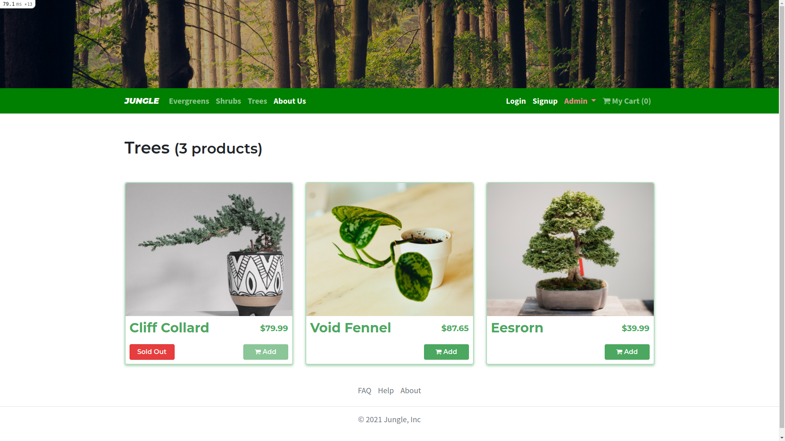
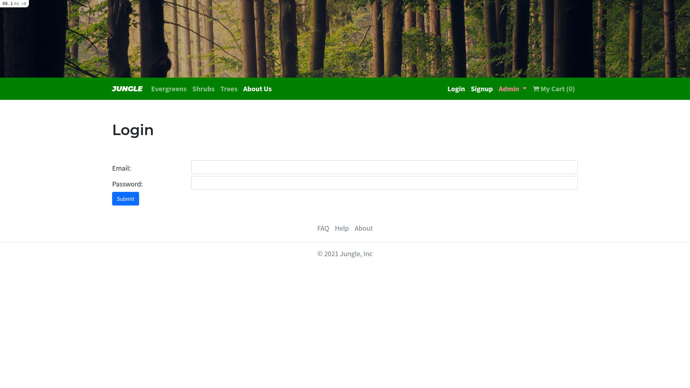
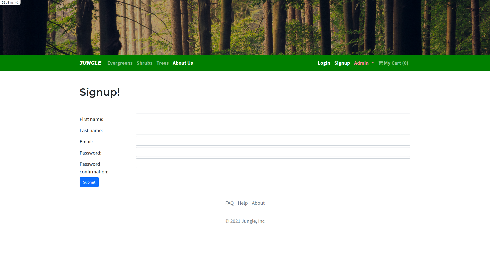
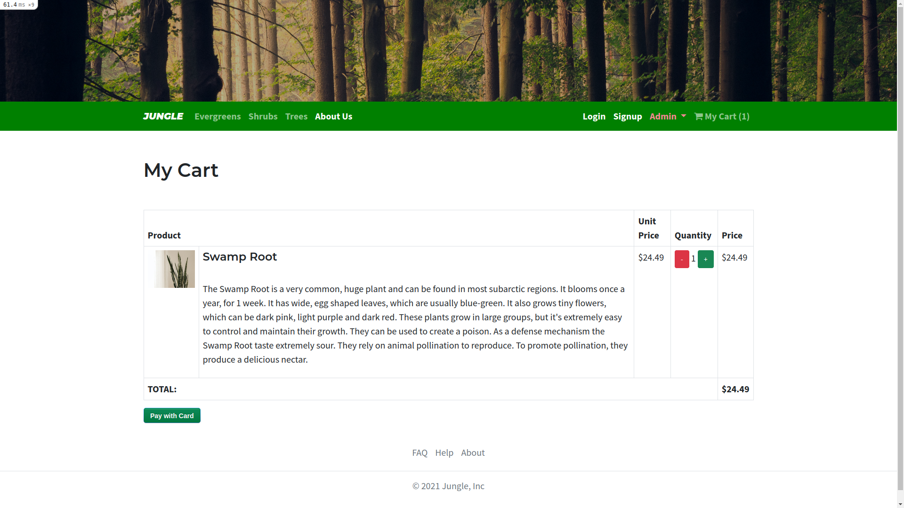
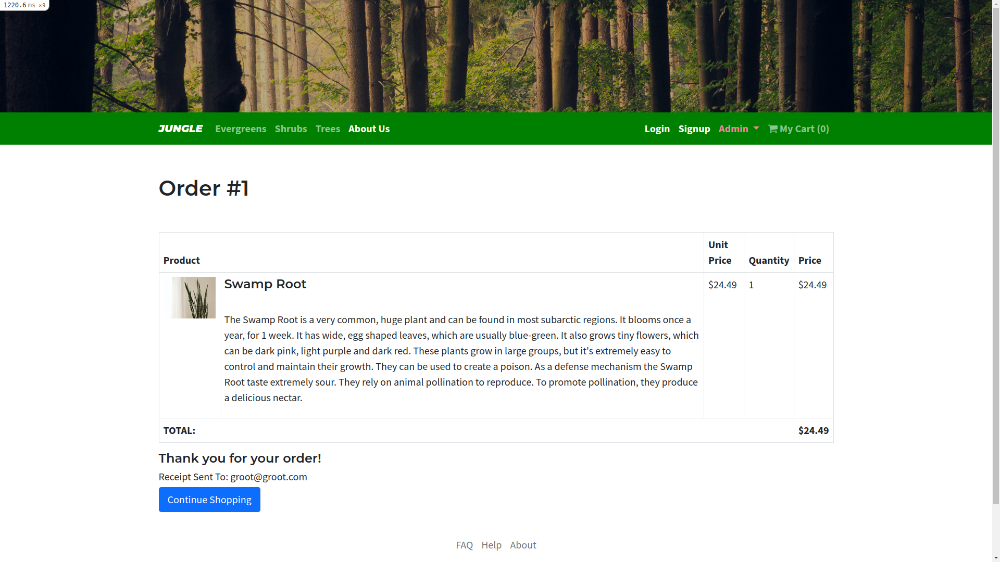
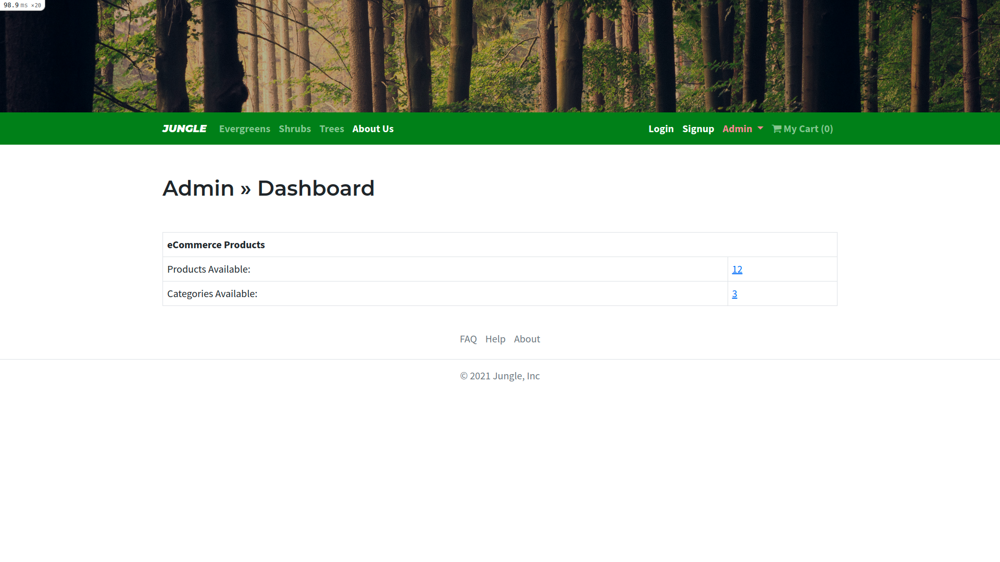
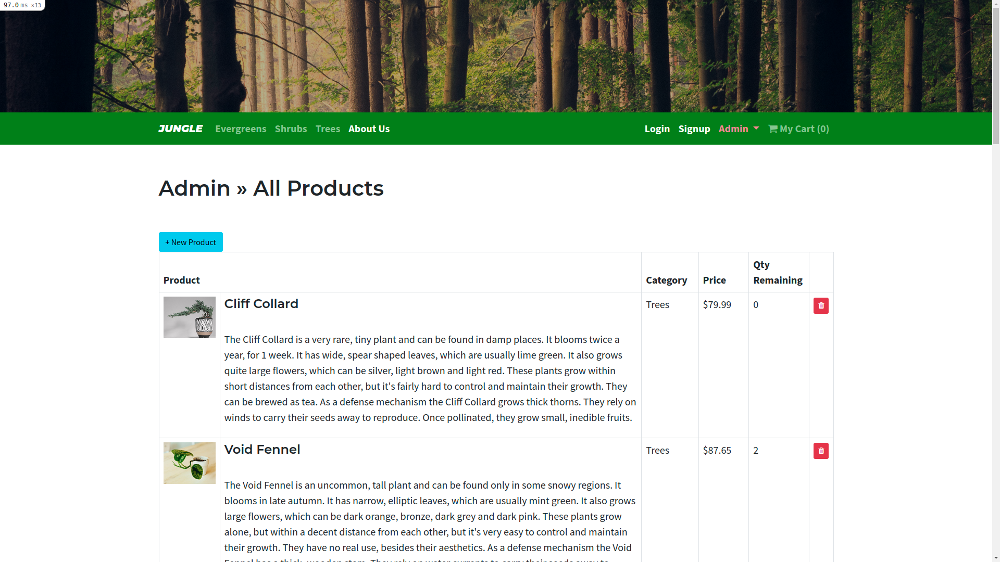
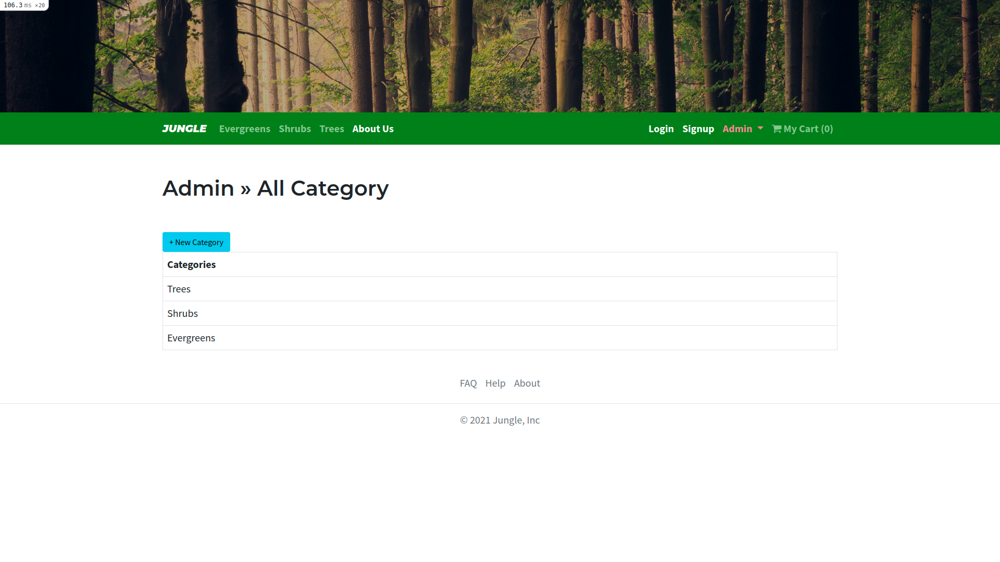

# Dependencies

## Gem

- ruby '3.1.1'
- rails, '6.1.5.1'
- pg
- puma, '~> 5.0'
- sass-rails, '>= 6'
- webpacker, '~> 5.0'
- turbolinks, '~> 5'
- jbuilder, '~> 2.7'
- jquery-rails'
- sdoc, group: :doc
- bcrypt, '~> 3.1.7'
- bootstrap, '~> 5.0.1'
- font-awesome-rails
- money-rails
- stripe
- rmagick
- carrierwave
- faker

## Node

- rails/actioncable "^6.0.0",
- rails/activestorage "^6.0.0",
- rails/ujs "^6.0.0",
- rails/webpacker "5.4.0",
- turbolinks "^5.2.0",
- webpack "^4.46.0",
- webpack-cli "^3.3.12"

# Development Dependencies

## Gem

- byebug platforms: %i[mri mingw x64_mingw]
- cypress-rails
- database_cleaner-active_record
- dotenv-rails
- net-smtp require: false
- rspec-rails '~> 5.1'
- web-console '>= 4.1.0'
- listen '~> 3.3'
- rack-mini-profiler '~> 2.0'
- spring

## Node

- cypress "^9.6.1",
- webpack-dev-server "^3.11.2"

# Getting Started

1. Run `bundle install` to install dependencies
2. Create `config/database.yml` by copying `config/database.example.yml`
3. Create `config/secrets.yml` by copying `config/secrets.example.yml`
4. Run `bin/rails db:reset` to create, load and seed db
5. Create `.env` file based on `.env.example`
6. Sign up for a Stripe account
7. Put Stripe (test) keys into appropriate .env vars
8. Run `bin/rails s -b 0.0.0.0` to start the server

## Database

If Rails is complaining about authentication to the database, uncomment the user and password fields from `config/database.yml` in the development and test sections, and replace if necessary the user and password `development` to an existing database user.

## Stripe Testing

Use Credit Card # 4111 1111 1111 1111 for testing success scenarios.

More information in their docs: <https://stripe.com/docs/testing#cards>
